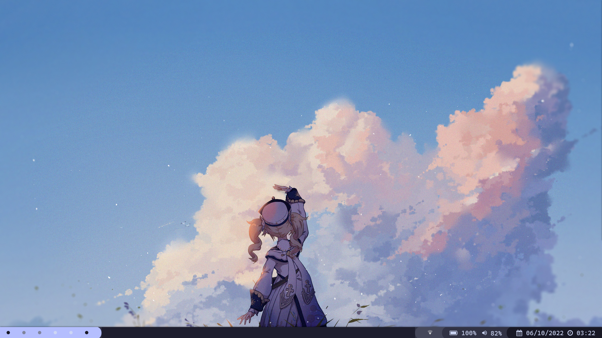
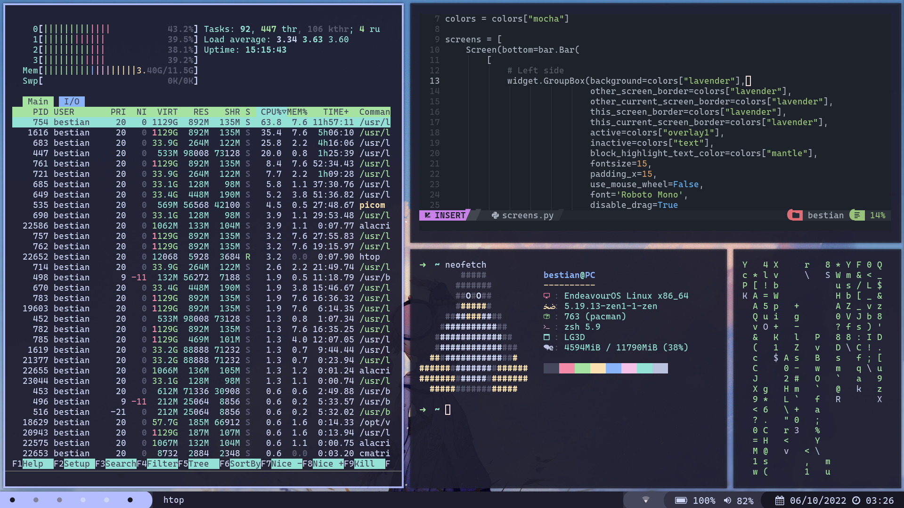

# Dotfiles

My dotfiles archives for my qtile.

## Start mode:



## Tiling mode:



# Packages

For the oficial repositories just use pacman and for the Arch User Repositories
I will use yay.

## Main packages:

```bash
sudo pacman -S qtile alacritty rofi pavucontrol zsh nitrogen pamixer playerctl brightnessctl network-manager-applet numlockx scrot feh
```

## Some apps

```bash
yay -S zathura qimgv-git escrotum-git
```

## Compositor:

Choose the compositor of your preference.

Picom for basic configuration, best perfomance.
```bash
sudo pacman -S picom
```

Picom of Jonaburg for more configuration and animations, worst performance.
```bash
yay -S picom-jonaburg-git
```

## Thunar as file explorer and their plugins/tools:

```bash
sudo pacman -S thunar xarchiver thunar-archive-plugin tumbler glib2 gvfs
```

## Dunst as notification manager:

```bash
sudo pacman -S dunst
```

## Some fonts:

```bash
sudo pacman -S ttf-cascadia-code noto-fonts-emoji ttf-mononoki-nerd ttf-roboto-mono-nerd
```

## Lightdm as display manager:

```bash
yay -S lightdm lightdm-gtk-greeter
```

For activate ly on boot use systemctl as sudo.

```bash
sudo systemctl enable lightdm.service
```

# Install config

For install the my config files.
```bash
git clone https://github.com/bestiannn/dotfiles
cd dotfiles/
cd .config/
#Copy all the folders to your config folder
#WARINIG: This command will overwrite your others folders
cp -r * ~/.config/
```

# Auto install packages

For install all the packages before named, use:
```bash
sh install-packages.sh
```

# Qtile keys

## Basic keys:

| Key                      | Action                                                   |
| ------------------------ | -------------------------------------------------------- |
| **mod + return**         | launch alacritty                                         |
| **mod + arrows**         | select window                                            |
| **mod + shift + arrows** | move selected window                                     |
| **mod + ctrl + arrows**  | modify size window                                       |
| **mod + [1-6]**          | go to workspace [1-6]                                    |
| **mod + w**              | close window                                             |
| **mod + b**              | toggle bar                                               |
| **mod + Tab**            | next layout                                              |
| **mod + f**              | toggle fullscreen                                        |
| **mod + \|**             | toggle group between screens (only works with 2 screens) |
| **mod + p**              | flip layout                                              |
| **mod + ctrl + r**       | restart qtile                                            |
| **mod + ctrl + q**       | logout qtile                                             |

## Launch apps keys:

| Key                 | Action                               |
| ------------------- | ------------------------------------ |
| **mod + m**         | launch rofi (rofi with custom theme) |
| **mod + e**         | launch thunar                        |
| **mod + s**         | screenshoot current window           |
| **mod + shift + s** | screenshoot selected area            |

# Github apps

Some of the apps I use, the installation is in their README

- [Oh My Zsh](https://github.com/ohmyzsh/ohmyzsh)
- [Catppuccin Theme](https://github.com/catppuccin/catppuccin)
    - Rofi (Basic)
    - Cursors
    - GTK
    - Papirus Folders
    - Dark Reader
    - Discord
- [NvChad](https://nvchad.com/)